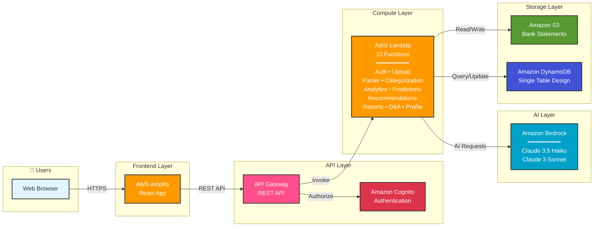
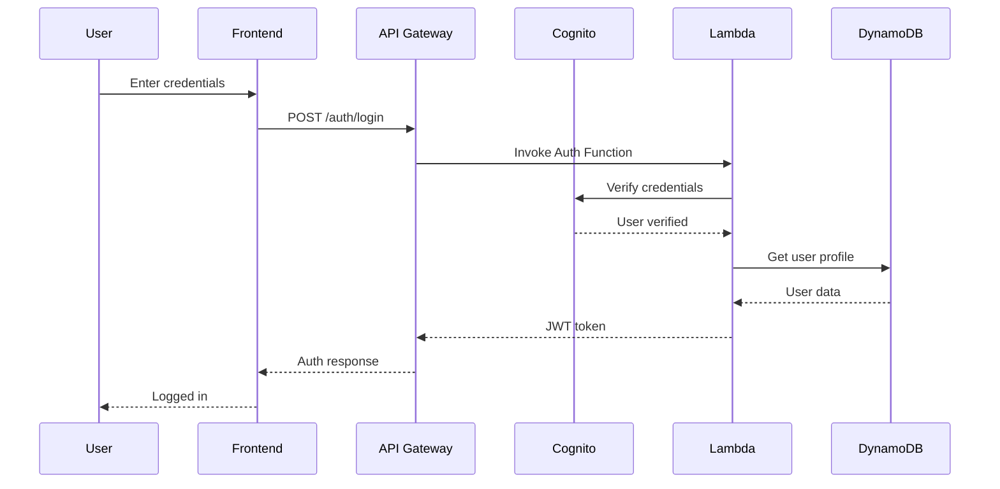
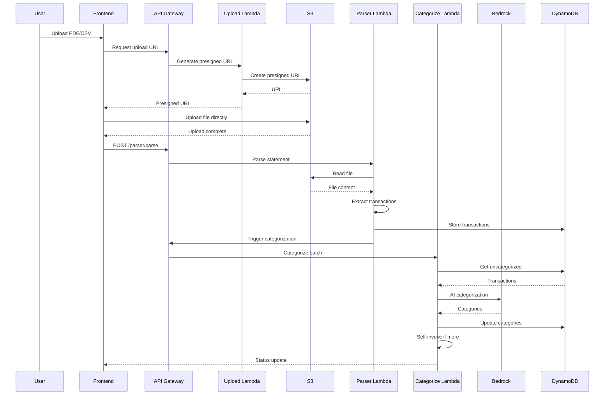
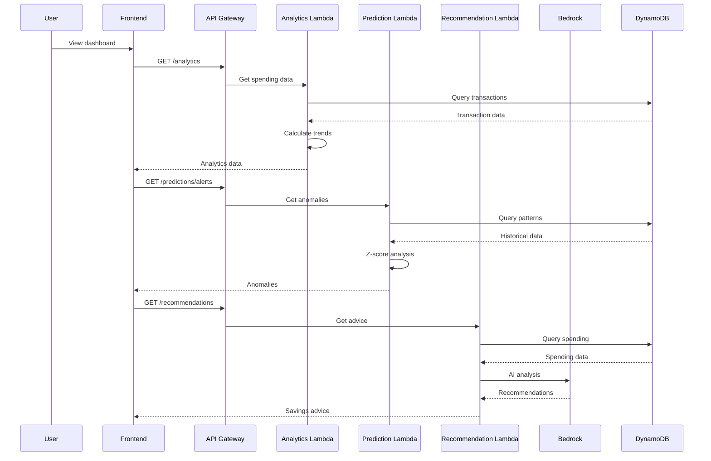
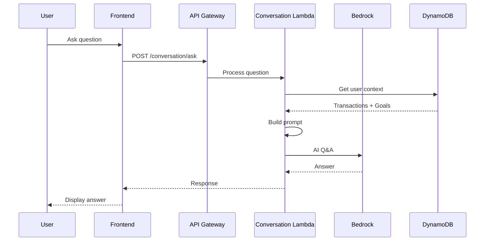
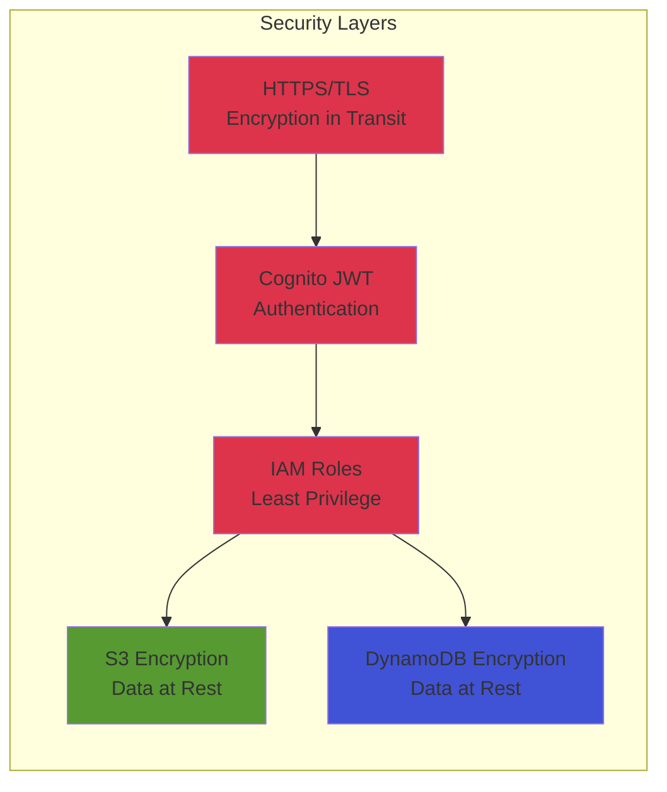

# N3xFin Architecture

## System Architecture Diagram



### High-Level Architecture Overview

**Request Flow**: User → Amplify → API Gateway → Cognito (Auth) → Lambda → Bedrock/S3/DynamoDB

**Key Components:**

1. **Frontend (AWS Amplify)**
   - React SPA with TypeScript
   - CI/CD from GitHub
   - Global CDN distribution

2. **API Layer**
   - API Gateway: REST endpoints with throttling
   - Cognito: JWT-based authentication

3. **Compute (AWS Lambda - 10 Functions)**
   - Auth, Upload, Parser, Categorization
   - Analytics, Predictions, Recommendations
   - Reports, Q&A, Profile

4. **AI (Amazon Bedrock)**
   - Claude 3.5 Haiku: Categorization, recommendations
   - Claude 3 Sonnet: PDF parsing

5. **Storage**
   - S3: Encrypted bank statement files
   - DynamoDB: All application data (single-table design)

## Data Flow

### 1. User Authentication Flow


### 2. Statement Upload & Processing Flow


### 3. Analytics & Insights Flow


### 4. Conversational AI Flow


## DynamoDB Table Design

### Single Table Design
```
Primary Key: PK (Partition Key) + SK (Sort Key)

Entity Types:
┌─────────────────────────────────────────────────────────────┐
│ USER                                                         │
│ PK: USER#<userId>                                           │
│ SK: PROFILE                                                 │
│ Attributes: email, createdAt, goals, preferences            │
└─────────────────────────────────────────────────────────────┘

┌─────────────────────────────────────────────────────────────┐
│ TRANSACTION                                                  │
│ PK: USER#<userId>                                           │
│ SK: TRANSACTION#<date>#<transactionId>                      │
│ Attributes: amount, description, category, balance          │
└─────────────────────────────────────────────────────────────┘

┌─────────────────────────────────────────────────────────────┐
│ REPORT                                                       │
│ PK: USER#<userId>                                           │
│ SK: REPORT#<YYYY-MM>                                        │
│ Attributes: totalSpending, savingsRate, insights            │
└─────────────────────────────────────────────────────────────┘

┌─────────────────────────────────────────────────────────────┐
│ FILE                                                         │
│ PK: USER#<userId>                                           │
│ SK: FILE#<fileKey>                                          │
│ Attributes: filename, uploadedAt, status, s3Key             │
└─────────────────────────────────────────────────────────────┘

Access Patterns:
1. Get user profile: Query PK=USER#<id>, SK=PROFILE
2. Get transactions by date: Query PK=USER#<id>, SK begins_with TRANSACTION#<date>
3. Get all transactions: Query PK=USER#<id>, SK begins_with TRANSACTION#
4. Get monthly report: Query PK=USER#<id>, SK=REPORT#<YYYY-MM>
5. List user files: Query PK=USER#<id>, SK begins_with FILE#
```

## AWS Services Used

| Service | Purpose | Free Tier Limit |
|---------|---------|-----------------|
| **AWS Amplify** | Frontend hosting, CI/CD | 1,000 build minutes/month, 15 GB served |
| **API Gateway** | REST API endpoints | 1M requests/month |
| **AWS Lambda** | Serverless compute | 1M requests/month, 400K GB-seconds |
| **Amazon Cognito** | User authentication | 50,000 MAUs |
| **Amazon DynamoDB** | NoSQL database | 25 GB storage, 25 RCU/WCU |
| **Amazon S3** | File storage | 5 GB storage, 20K GET, 2K PUT |
| **Amazon Bedrock** | AI/ML (Claude 3.5 Haiku + Claude 3 Sonnet) | Pay per token (~$0.001/1K input for Haiku) |

## Security Architecture



### Security Features
- **Authentication**: Amazon Cognito with JWT tokens
- **Authorization**: IAM roles with least-privilege access
- **Encryption in Transit**: HTTPS/TLS for all API calls
- **Encryption at Rest**: S3 and DynamoDB server-side encryption
- **API Security**: API Gateway throttling and request validation
- **Data Isolation**: User data partitioned by userId in DynamoDB
- **Secure File Upload**: Presigned S3 URLs with expiration

## Scalability & Performance

### Optimization Strategies
1. **Caching**: Frontend caches analytics data with stale-while-revalidate
2. **Batch Processing**: Categorization processes 50 transactions per Bedrock call
3. **Async Processing**: Large uploads trigger Lambda self-invocation chains
4. **Data Preloading**: Common time ranges preloaded on dashboard
5. **Efficient Queries**: DynamoDB composite keys enable single-query access patterns
6. **Serverless Auto-scaling**: Lambda scales automatically with demand

### Performance Metrics
- **Dashboard Load**: < 2 seconds (with cached data)
- **File Upload**: < 5 seconds for 100 transactions
- **Categorization**: ~2 seconds per 50 transactions
- **AI Q&A Response**: < 3 seconds
- **Report Generation**: < 5 seconds

## Cost Optimization

### Staying Within Free Tier
- **Lambda**: Optimized function size and execution time
- **DynamoDB**: Single-table design minimizes queries
- **Bedrock**: Batch processing reduces API calls by 50x
- **S3**: Files deleted after processing (optional)
- **API Gateway**: Caching reduces redundant requests

### Estimated Monthly Costs (Beyond Free Tier)
- Lambda: $0 (within free tier for typical usage)
- DynamoDB: $0 (within free tier for < 1000 users)
- S3: $0 (within free tier for < 100 statements/month)
- Bedrock: $5-15 (main cost driver, no free tier)
- **Total**: ~$5-15/month for demo/competition usage

